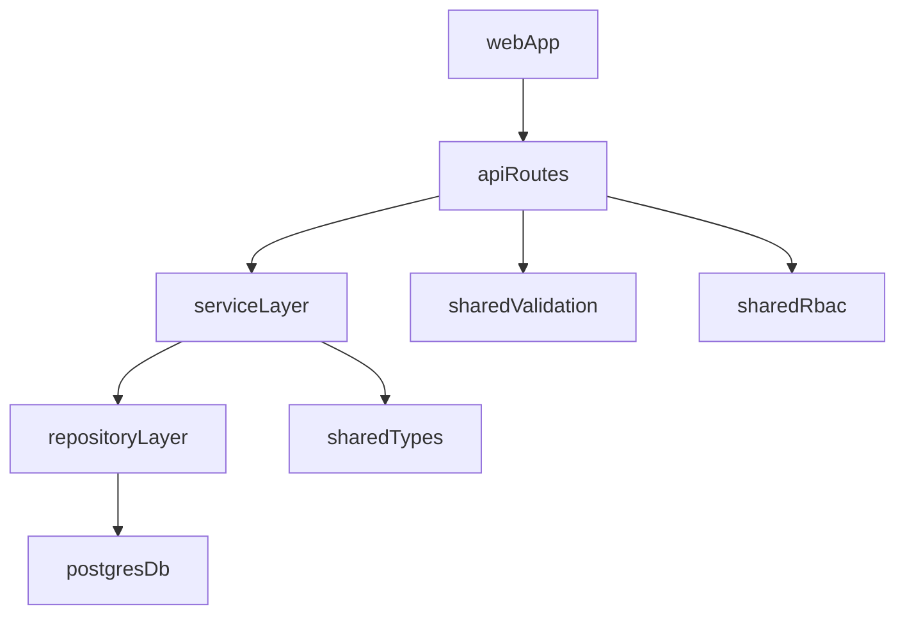

# Architecture

## Overview
- Nx monorepo with React web app, Fastify API, and AWS CDK skeleton.
- Shared libraries for domain types, validation, and RBAC helpers.
- Engineering policy and quality gates are defined in `docs/engineeringpractices.md`.

Interpretation keywords in this document follow policy language:
- **MUST** / **MUST NOT**: mandatory requirement.
- **SHOULD** / **SHOULD NOT**: strong recommendation; deviation requires justification.

## Services
- `apps/api`: Fastify + Prisma, JWT auth, RBAC enforcement.
- `apps/web`: React + React Router, communicates with API via REST.
- `apps/infra`: CDK placeholder stacks (S3, SQS, CloudFront, Lambda).

## Data
- PostgreSQL for persistence.
- Prisma schema defines User, Client, WorkspaceMember, Assessment, and AssessmentDomainScore.

## Dependency Direction and Boundaries

Architecture follows a layered dependency model:

Allowed dependency flow:
- Web -> API contracts (never DB layer).
- API routes -> service layer -> repository layer.
- Repository layer -> Prisma/PostgreSQL.
- Shared libs (`libs/shared-*`) are reusable dependencies and **MUST** remain app-agnostic.

Disallowed coupling:
- Route handlers containing complex domain logic.
- Cross-imports from infrastructure concerns into shared libraries.
- UI components depending on server-only implementation details.

## Current Implementation Patterns

- Fastify routes **MUST** handle validation/authz and delegate to composable service functions.
- Prisma queries **MUST** remain inside repository/data access modules.
- Cross-cutting concerns (validation, RBAC helpers, logging, metrics) **SHOULD** be implemented once and reused.

## Evolution Guidance

- Teams **SHOULD** extend behavior through composition over adding deep inheritance hierarchies.
- Teams **MUST NOT** add new shared abstractions until a real duplication pattern appears in at least two call sites.
- For architecture-impacting changes, teams **MUST** add a dated entry in `docs/DECISIONS.md`.
