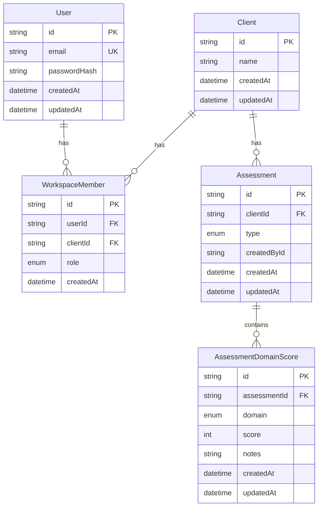

# Data Structure (DB Schema)

This document describes the **current PostgreSQL schema** as defined in `prisma/schema.prisma` and applied via Prisma migrations in `prisma/migrations/`.

## Summary

- **DB**: PostgreSQL
- **ORM**: Prisma
- **Tenant boundary**: `Client` (the PRD refers to this concept as a “Workspace”)
- **Core feature schema (MVP)**: Assessments with per-domain scores

## Naming note (PRD vs DB)

The PRD uses the term **Workspace** for the tenant boundary. In the DB schema, the tenant entity is currently named **`Client`** and membership is represented by **`WorkspaceMember`**.

- In this document:
  - **Workspace (tenant)** ≈ `Client`
  - **Membership** = `WorkspaceMember` (user ↔ workspace/client with a role)

## Enums

### `Role`

- `OWNER`
- `CONSULTANT`
- `VIEWER`

### `AssessmentType`

- `AI_ADOPTION`
- `DIGITAL_TRANSFORMATION`

### `AssessmentDomain`

- `STRATEGY`
- `PROCESS`
- `DATA`
- `TECH`
- `PEOPLE`
- `GOVERNANCE`
- `SECURITY`

## Entities

### `User`

Represents an authenticated identity (email/password).

- **Columns**
  - `id` (uuid string, PK)
  - `email` (string, unique)
  - `passwordHash` (string)
  - `createdAt` (timestamp, default now)
  - `updatedAt` (timestamp, updated-at trigger)
- **Relationships**
  - 1 `User` → many `WorkspaceMember` records (`members`)
- **Constraints / Indexes**
  - Unique: `email`

### `Client` (Workspace / Tenant)

Represents the tenant boundary for scoping all client/workspace data.

- **Columns**
  - `id` (uuid string, PK)
  - `name` (string)
  - `createdAt` (timestamp, default now)
  - `updatedAt` (timestamp, updated-at trigger)
- **Relationships**
  - 1 `Client` → many `WorkspaceMember` (`members`)
  - 1 `Client` → many `Assessment` (`assessments`)

### `WorkspaceMember`

Represents a user’s membership in a workspace (tenant) with a role.

- **Columns**
  - `id` (uuid string, PK)
  - `userId` (FK → `User.id`)
  - `clientId` (FK → `Client.id`)
  - `role` (`Role`)
  - `createdAt` (timestamp, default now)
- **Relationships**
  - many `WorkspaceMember` → 1 `User`
  - many `WorkspaceMember` → 1 `Client`
- **Constraints / Indexes**
  - Unique: (`userId`, `clientId`) (a user can be a member of a client only once)
  - Index: `userId`
  - Index: `clientId`

### `Assessment`

Top-level assessment record scoped to a workspace/client.

- **Columns**
  - `id` (uuid string, PK)
  - `clientId` (FK → `Client.id`)
  - `type` (`AssessmentType`)
  - `createdById` (nullable string; currently **not** a declared FK)
  - `createdAt` (timestamp, default now)
  - `updatedAt` (timestamp, updated-at trigger)
- **Relationships**
  - many `Assessment` → 1 `Client`
  - 1 `Assessment` → many `AssessmentDomainScore` (`scores`)
- **Constraints / Indexes**
  - Index: (`clientId`, `createdAt`) for listing assessments by workspace over time

### `AssessmentDomainScore`

Per-domain score (and optional notes) for a single assessment.

- **Columns**
  - `id` (uuid string, PK)
  - `assessmentId` (FK → `Assessment.id`)
  - `domain` (`AssessmentDomain`)
  - `score` (int)
  - `notes` (nullable string)
  - `createdAt` (timestamp, default now)
  - `updatedAt` (timestamp, updated-at trigger)
- **Relationships**
  - many `AssessmentDomainScore` → 1 `Assessment`
- **Constraints / Indexes**
  - Unique: (`assessmentId`, `domain`) (one score per domain per assessment)
  - Index: `assessmentId`

## Relationship diagram (logical)

## Tenancy & access rules (how to use this schema)

- **Tenant scoping**:
  - All assessments are scoped by `Assessment.clientId`.
  - Membership and authorization is derived from `WorkspaceMember` for a given `clientId`.
- **RBAC**:
  - Role is stored on `WorkspaceMember.role`.
  - “Write” privileges typically apply to `OWNER` and `CONSULTANT`.
  - “Read-only” role is `VIEWER`.

## Notable implementation notes / follow-ups

- **`createdById` is not a foreign key** today. If you want referential integrity (and easy joins), consider turning it into `createdByUserId` with a Prisma relation to `User`.
- **Naming consistency**: consider renaming `Client` → `Workspace` in Prisma (and migrations) if you want the DB model to match the PRD language.

